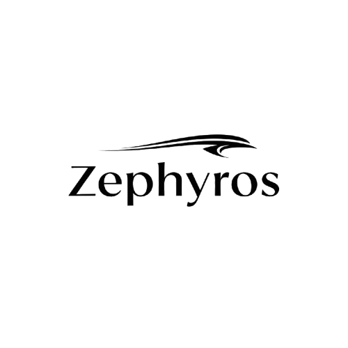

#  Zephyros - Collaborative AI Code Editor
  

<div align="right">
  <h2>Current Demo Video</h2>
  
</div>


> **Zephyros**,
> Real-time collaborative coding powered by Socket.io, with integrated live chat for seamless communication.
> In-browser development using WebContainers, AI-assisted coding, and full server execution for an end-to-end workflow.

## Features ✅

- **Authentication:** Fully implemented frontend & backend login/signup system.
- **Home Page:** Responsive and clean landing page.

## Planned Features 🌟

- **Real-time Collaborative Code Editor**: Multiple users can edit the same code simultaneously.
- **Integrated Chat**: Communicate with collaborators in real-time.
- **AI Assistant**: Invoke AI using `@` to get code suggestions, run code, or perform tasks.
- **Multi-language Support**: Planned support for popular programming languages.
- **Web Containers**: Planned to have a In-browser development using WebContainers

## Tech Stack 🛠️

- **Frontend:** React.js, Tailwind CSS
- **Backend:** Node.js, Express.js, MongoDB
- **Real-time Communication:** Socket.IO / WebSockets (planned)
- **AI Integration:** Gemini API (planned)

## Project Status 📝

- Authentication: ✅ Completed
- Home Page: ✅ Completed
- Collaborative Code Editor: 🚧 In Progress
- AI Assistant: 🚧 In Progress
- Real Time Chat: 🚧 In Progress
- WebContainers: 🚧 In Progress

---

## 📂 Current Project Structure  
```bash
Zephyros-AI-Code-Editor/
├── Backend/
│   ├── app.js
│   ├── controllers/
│   ├── db/
│   ├── middlewares/
│   ├── models/
│   ├── package-lock.json
│   ├── package.json
│   ├── README.md
│   ├── routes/
│   ├── server.js
│   ├── services/
└── frontend/
    ├── .gitignore
    ├── index.html
    ├── package-lock.json
    ├── package.json
    ├── public/
    ├── README.md
    ├── src/
    │   ├── App.jsx
    │   ├── assets/
    │   ├── config/
    │   ├── routes/
    │   ├── screens/
    │   ├── context/
    │   ├── index.css
    │   ├── main.jsx
    └── vite.config.js

```

---

## 🚀 Getting Started  

```bash
# Clone the repository
git clone https://github.com/ancure-2004/Zephyros-AI-Code-Editor.git

# Install dependencies
cd Zephyros-AI-Code-Editor

#Frontend dependencies
cd frontend
npm install

#backend dependencies
cd backend
npm install

# Run backend
cd backend
npx nodemon

# Run frontend
cd frontend
npm run dev
```
---

## Environment Variables

Create a `.env` file in the **backend** root directory and add the following variables:

```env
PORT="Enter PORT"
MONGODB_URI="Enter your mongoDB connection string"
JWT_SECRET="Enter Your secret key"
REDIS_HOST = "Your Redis Host Key"
REDIS_PORT = "Redis Port"
REDIS_PASSWORD = "Your Redis Password"
```
---

## 🤝 Contributing
# We welcome contributions!
- Fork the repository
- Create a new branch (git checkout -b feature-name)
- Make your changes and commit (git commit -m 'Add feature')
- Push to the branch (git push origin feature-name)
- Open a Pull Request

---

## License

This project is licensed under the [MIT License](LICENSE).

### Contact
- 📧 ankur2004tyagi@gmail.com
- 🔗 www.linkedin.com/in/ankur-tyagi2004
